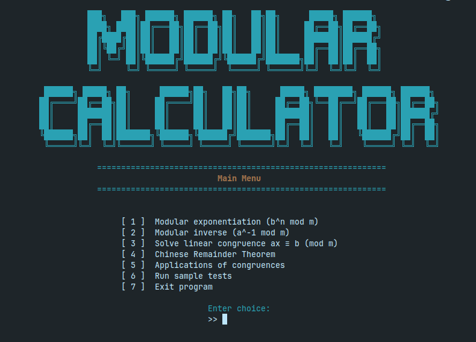

# Modular Arithmetic Calculator

A comprehensive C++ command-line application implementing fundamental modular arithmetic operations and number theory concepts from discrete mathematics.

## 📋 Project Overview

**Modular Arithmetic Calculator** is a CLI-based utility designed to perform core modular arithmetic operations including Extended GCD, modular inverses, solving congruences with the Chinese Remainder Theorem, and real-world applications like UPC and ISBN verification. Developed as part of CSC101 - Discrete Mathematics course at the University of Engineering and Technology, Lahore.

### Team Members
- **Ali Amir** (2025-CS-127) - elleyemir24@gmail.com
- **Eman Fatima** (2025-CS-151) - emanfatima89992@gmail.com
- **Mahnoor Mushtaq** (2025-CS-131) - mahnoormushtaq09@gmail.com

**Session:** Fall'25 Morning   
**Section:** C  
**Semester:** 1st  
**Course:** CSC101 - Discrete Mathematics  
**Instructor:** Mr. Waqas Ali  
**Submission Date:** January 6, 2026

## 🚀 Features

### Core Operations
- **Fast Modular Exponentiation**: Computes b^n mod m using binary expansion
- **Modular Inverse**: Calculates a⁻¹ mod m using Extended Euclidean Algorithm
- **Linear Congruence Solver**: Solves equations of form ax ≡ b (mod m)
- **Chinese Remainder Theorem**: Solves systems of simultaneous congruences

### Real-World Applications
- **Parity Bit**: Generate and verify parity bits for binary sequences
- **UPC Codes**: Validate and generate check digits for Universal Product Codes
- **ISBN-10**: Verify and generate check digits for International Standard Book Numbers

### Supporting Functions
- Extended Euclidean Algorithm with step-by-step visualization
- Congruence verification
- Interactive sample test suite

## 🛠 Technology Stack

- **Language**: C++17
- **Libraries**: Standard C++ libraries only (with Windows compatibility layer)
- **Development Tools**: VS Code, Git/GitHub
- **Platform**: Cross-platform (Windows/Linux/macOS)

## 📚 Mathematical Foundations

The project implements concepts from Kenneth H. Rosen's *Discrete Mathematics and Its Applications*:

1. **Modular Arithmetic & Congruences**
   - Formal definition: a ≡ b (mod m) ⇔ m | (a - b)

2. **Euclidean Algorithms**
   - Extended Euclidean Algorithm for Bézout coefficients: s·a + t·b = gcd(a, b)

3. **Modular Exponentiation**
   - Fast exponentiation using binary expansion

4. **Chinese Remainder Theorem**
   - Solving systems: x ≡ a₁ (mod m₁), ..., x ≡ aₖ (mod mₖ)
   - Requires pairwise relatively prime moduli

## 🖥 User Interface

### Main Menu


The application features an interactive CLI with:
- ANSI color-coded output
- Typing effect animations
- Loading screens
- Clear navigation menus

### Application Flow
1. **Main Menu** → Select operation type
2. **Input Screens** → Enter required parameters
3. **Calculation** → View results with optional step-by-step details
4. **Navigation** → Return to menus or exit

### Key Screens
- **Modular Exponentiation Screen**: Input b, n, m for b^n mod m
- **Chinese Remainder Theorem Screen**: Solve multiple congruences
- **Applications Menu**: Access parity bit, UPC, and ISBN tools

## ⚙️ Installation & Usage

### Prerequisites
- C++17 compatible compiler (g++, clang++, or MSVC)
- Terminal/Command Prompt with ANSI escape code support

### Compilation
```bash
g++ -std=c++17 project.cpp -o modular_calculator
```

### Running the Application
```bash
./modular_calculator  # Linux/macOS
modular_calculator.exe # Windows
```

## 📊 Sample Test Cases

The application includes built-in test cases:

| Test | Input | Expected Output | Status |
|------|-------|----------------|--------|
| Modular Exponentiation | b=5, n=3, m=13 | 8 | ✅ Pass |
| Modular Inverse | a=3, m=11 | 4 | ✅ Pass |
| Chinese Remainder Theorem | x≡2(mod3), x≡3(mod5) | 8 | ✅ Pass |

## ⚠️ Limitations

1. **Numerical Capacity**: Uses 64-bit integers (`long long`), limiting values to ~2⁶³-1
2. **Algorithmic Constraints**: 
   - Linear congruence solver returns single solution only
   - CRT requires pairwise coprime moduli
3. **Scope**: 
   - ISBN support limited to ISBN-10 only
   - No ISBN-13 support

## 🔮 Future Improvements

1. **Arbitrary-Precision Arithmetic**: Integrate BigInt library for cryptographic-scale numbers
2. **Extended Functionality**:
   - Support for non-coprime moduli in CRT
   - ISBN-13 validation
   - Additional cryptographic applications
3. **Enhanced UI**: 
   - Graphical User Interface (GUI)
   - Web-based interface
   - Real-time algorithm visualization

## 📖 References & Resources

### Primary Textbook
- Rosen, K. H. *Discrete Mathematics and Its Applications* (8th ed.)

### Online Resources
- Brilliant.org: [Chinese Remainder Theorem](https://brilliant.org/wiki/chinese-remainder-theorem/)
- GeeksforGeeks: [Euclidean Algorithms](https://www.geeksforgeeks.org/dsa/euclidean-algorithms-basic-and-extended/)

### Project Resources
- **GitHub Repository**: [Link to repository](https://github.com/DM-Project-Mod-Calculator/DM-Project.git)
- **Demo Video**: [Link to demonstration](https://www.linkedin.com/posts/ali-amir-code_uetlahore-computerscience-discretemathematics-activity-7413498261010931712-UiHo?utm_source=share&utm_medium=member_desktop&rcm=ACoAAEOsBxQBLe8IByM_Ok6MlCPbs-DX45ZV6vk)

### Code References
- Extended Euclidean Algorithm implementation adapted from GeeksforGeeks

### AI Assistance
- Used for code review and bug detection in final stages

## 📄 License

University project - for academic purposes only.

## 👥 Acknowledgments

- Mr. Waqas Ali for course guidance
- Kenneth H. Rosen for textbook foundation
- Online communities for algorithm references

---

*Developed with ❤️ by Team [Ali Amir, Eman Fatima & Mahnoor Mushtaq] - UET Lahore, Fall 2025*